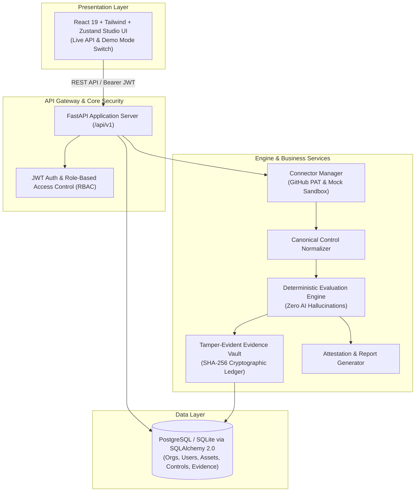

# GRC Engine

Privacy-first compliance discovery and policy auditing platform. 
Prototype / research-oriented GRC platform

[ [Live Demo](https://grc-engine.vercel.app) ] [ [API Docs](docs/API_DOCUMENTATION.md) ] [ [Threat Model](docs/THREAT_MODEL.md) ] [ [Security Model](docs/SECURITY_MODEL.md) ] [ [Demo Walkthrough](docs/DEMO_WALKTHROUGH.md) ]

```text
   ██████╗ ██████╗  ██████╗    ███████╗███╗   ██╗ ██████╗ ██╗███╗   ██╗███████╗
  ██╔════╝ ██╔══██╗██╔════╝    ██╔════╝████╗  ██║██╔════╝ ██║████╗  ██║██╔════╝
  ██║  ███╗██████╔╝██║         █████╗  ██╔██╗ ██║██║  ███╗██║██╔██╗ ██║█████╗  
  ██║   ██║██╔══██╗██║         ██╔══╝  ██║╚██╗██║██║   ██║██║██║╚██╗██║██╔══╝  
  ╚██████╔╝██║  ██║╚██████╗    ███████╗██║ ╚████║╚██████╔╝██║██║ ╚████║███████╗
   ╚═════╝ ╚═╝  ╚═╝ ╚═════╝    ╚══════╝╚═╝  ╚═══╝ ╚═════╝ ╚═╝╚═╝  ╚═══╝╚══════╝
```

[](https://grc-engine.vercel.app)
[](https://github.com/kab5DeR4/grc-engine/actions)
[](https://fastapi.tiangolo.com)
[](https://www.sqlalchemy.org)
[](https://react.dev)
[](https://tailwindcss.com)
[](backend/tests/)
[](https://opensource.org/licenses/MIT)

---

## 💡 Why GRC Engine?

Traditional compliance platforms (e.g. Vanta, Drata, Archer) historically began as subjective questionnaires and manual policy document drives. 

**GRC Engine turns compliance upside down:**
- **Infrastructure is the single source of truth:** Compliance state is derived directly from live version control, IAM configurations, and cloud provider telemetry.
- **Zero-Hallucination Determinism:** Compliance pass/fail logic is 100% mathematical and rule-based—AI models never decide whether a regulatory control passes.
- **Cryptographic Tamper-Evident Proofs:** Every ingested configuration snapshot is hashed using SHA-256 to create immutable, auditor-verifiable ledgers.
- **Multi-Standard Regulatory Mapping:** Unified canonical controls map seamlessly across **SOC 2 Type II, ISO/IEC 27001:2022, NIST CSF 2.0, CIS Controls v8, and GDPR**.

---

## 🏛️ System Architecture

### High-Level Architecture


### Continuous Compliance Telemetry Pipeline
```text
┌─────────────────┐       ┌─────────────────┐       ┌─────────────────┐       ┌─────────────────┐       ┌─────────────────┐
│ Infrastructure  │  ──►  │ Asset Discovery │  ──►  │ Canonical Norm. │  ──►  │ Rule Evaluation │  ──►  │ SHA-256 Ledger  │
│  (GitHub, AWS)  │       │ (Repos, S3, IAM)│       │ (Vendor-Agnostic│       │ (100% Math PASS)│       │ (Tamper-Evident)│
└─────────────────┘       └─────────────────┘       └─────────────────┘       └─────────────────┘       └─────────────────┘
```

---

## 🖥️ Screenshots & Live Dashboard

> Experience the live dashboard with real-time persona switching (Platform Admin, Security Engineer, External Auditor) and theme selector.


🚀 **Try the interactive app:** [https://grc-engine.vercel.app](https://grc-engine.vercel.app)

---

## 🔑 Demo Credentials & Personas

Explore the live app or local server with pre-configured role personas:

| Persona / Role | Email | Password | Clearance Level | Operational Scope |
| :--- | :--- | :--- | :--- | :--- |
| 👑 **Platform Admin** | `admin@grcengine.com` | `demo123` | **Level 5 — Root Sovereign** | Full workspace administration, API key rotation, scans & fixes. |
| 🛡️ **Security Engineer** | `marcus.vance@acmesystems.io` | `demo123` | **Level 4 — SecOps Operator** | Trigger cluster scans, evaluate drift, execute remediation. |
| 🔍 **External Auditor** | `sarah.jenkins@ey-audit.com` | `demo123` | **Level 2 — Attestation Reviewer** | Read-only access to evidence vault and attestation export. |
| 📊 **Read-Only Viewer** | `maya.patel@acmesystems.io` | `demo123` | **Level 1 — Stakeholder Read** | Executive overview and compliance score tracking. |

> 💡 *In the live web UI, click **[ TRY DEMO WITHOUT LOGIN ]** or switch roles anytime via the header dropdown.*

---

## 📚 Complete Documentation Hub

| Document | Description |
| :--- | :--- |
| 📖 [**API Documentation**](docs/API_DOCUMENTATION.md) | Complete OpenAPI / REST API reference with curl examples for all endpoints. |
| 🛡️ [**Threat Model**](docs/THREAT_MODEL.md) | Comprehensive STRIDE & DREAD risk assessment, attack vectors, and trust boundaries. |
| 🔐 [**Security Model & RBAC**](docs/SECURITY_MODEL.md) | Deep dive into RBAC clearance hierarchy, SHA-256 canonical hashing, and data isolation. |
| 🧪 [**Control Evaluation Examples**](docs/CONTROL_EVALUATION_EXAMPLES.md) | Worked examples from raw vendor JSON to canonical controls and deterministic verdicts. |
| 📦 [**Sample Evidence JSON**](docs/SAMPLE_EVIDENCE.json) | Immutable cryptographic evidence proof records with SHA-256 signatures. |
| 📄 [**Sample Compliance Report**](docs/SAMPLE_COMPLIANCE_REPORT.md) | Realistic SOC 2 & ISO 27001 executive auditor attestation package. |
| 🧭 [**Evaluator Demo Walkthrough**](docs/DEMO_WALKTHROUGH.md) | 5-minute step-by-step evaluator guide for UI, API, and CLI. |
| ⚠️ [**Known Limitations**](docs/KNOWN_LIMITATIONS.md) | Honest engineering trade-offs regarding API rate limits, database concurrency, and scale. |
| 🗺️ [**Engineering Roadmap**](docs/ROADMAP.md) | Milestone release plans for AWS connectors, OPA / Rego engine, and real-time webhooks. |
| 🏷️ [**Release Notes v1.0.0**](RELEASE_NOTES.md) | Version 1.0.0 release notes and git tag instructions. |

---

## ⚡ Quick Start

### 1. Backend Setup

```bash
cd backend

# Create & activate virtual environment
python -m venv .venv
# On Windows:
.venv\Scripts\activate
# On Linux/macOS:
source .venv/bin/activate

# Install dependencies
pip install -r requirements.txt

# Run migrations & seed regulatory frameworks
alembic upgrade head
python scripts/seed_db.py

# Start application server
python server.py
```
> Backend runs on `http://127.0.0.1:8000` (Interactive Swagger docs at `http://127.0.0.1:8000/docs`).

### 2. Frontend Setup

```bash
cd frontend
npm install
npm run dev
```
> Frontend runs on `http://localhost:5173`.

### 3. Command-Line Policy Audit (CLI)

```bash
cd backend
python app.py
```
> Evaluates policy documents locally, outputs risk scoring, and generates `reports/audit_report.html`.

---

## 🧪 Test Suite Execution

GRC Engine includes an automated backend test suite with 27 unit and integration tests:

```bash
# Run complete backend test suite
python backend/tests/run_tests.py

# Or run with standard unittest
python -m unittest discover -s backend/tests -p "test_*.py"

# Run frontend linter and build check
cd frontend
npm run lint
npm run build
```

---

## 📊 Tech Stack Summary

| Layer | Technology | Purpose |
| :--- | :--- | :--- |
| **Frontend** | React 19, Vite, Tailwind CSS | Studio brutalist design system (`#E7E3DA` bone, `#1A1917` ink) |
| **State Management** | Zustand 5 | Client-side store with Dual Mode (Demo vs Live API Toggle) |
| **API Gateway** | FastAPI, Uvicorn, Pydantic v2 | High-performance async REST API with JWT authentication |
| **Database & ORM** | SQLAlchemy 2.0, Alembic, aiosqlite | Async relational engine supporting SQLite and PostgreSQL |
| **Security & Cryptography** | `bcrypt`, `python-jose`, `hashlib` | SHA-256 evidence integrity proofs & bcrypt password hashing |
| **Testing & CI/CD** | `unittest`, `httpx`, GitHub Actions | Automated matrix testing across Python and Node versions |

---

## 📄 License

Distributed under the MIT License. See [LICENSE](LICENSE) for more details.
